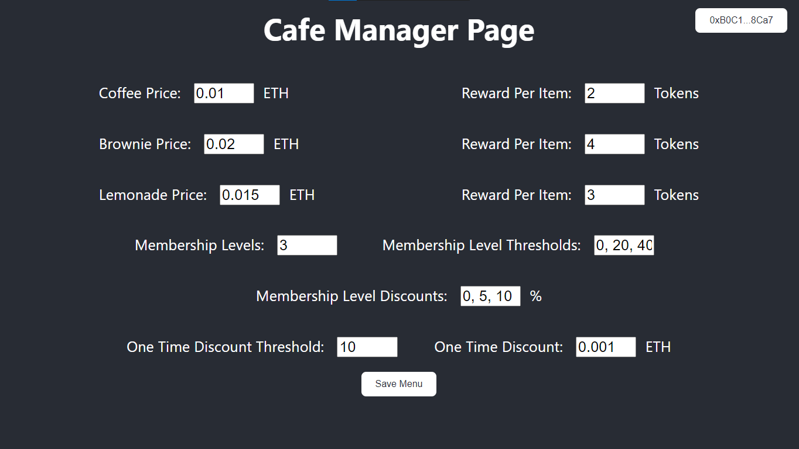

# Elevator Pitch

Are you tired with all this membership cards and apps from every single merchant? Let us put all of them on the blockchain. This project allows to create an ERC1155 contract to every merchant for their users and reward them with free items and/or life-time discounts on their product. Yes, you heard right, we are connecting physical world with web3.

# Inspiration

Altug’s physical wallet was full of membership cards and his phone full of merchant’s apps. One day he was so desperate that he decided to build a protocol and put all of cards into one place on blockchain. Altug told Luboš about his idea and Luboš, as Prague citizen, agreed and welcomed the idea very much because people in Prague spend all their time in the cafés (at least according to the rest of the country) and are hungry for rewards! Altug was so psyched that he even decided to go for it to ETH Prague Hackathon and start building this amazing app! So, here we go, folks!

# How it works (or should work once it is done)

## Merchant (a café owner)

Every merchant (a café owner) can deploy a membership card (ERC1155 template) using our template via our app and provide their users with a reward card. A café owner sets café menu with item prices, rewards (one time and life-time rewards) for each item, and deploys the contract via our app. Our app will help him to do it as the app will have prepared templates (arrange all items, prices etc. into the arrays and so on) in the future. There will be also a template to update their menus etc.

### Manager tab for a Cafe Owner

## User

It is kind of easy. More coffees (not only them!) users buy, more free coffees they get. For real OGs there is a real chance to gain life-time discounts.

### User tab for a Cafe loafer

#### Base Membership

#### Gold Membership

#### Platinum Membership

## Interaction

Our app will be equipped with two tabs – one for users, one for owners. Once user enters the café, he/she will open the app, select the Café from the drop menu, create an order in the app, and then click the checkout button. It will send notification to a café owner personal that there is an incoming order. Once it is paid by the user, another notification pops up to personal, and voila – coffees can be served. All discounts and rewards take place under the hood (our amazing contracts take care about that).

# Use cases

This app will be built (not ready yet of course as it was started at the hackathon) to honour especially the Prague citizens. But it can be used by anyone and not only for coffees! More templates are about to come, stay tuned anons!

# Smart Contract Architecture

There are three main parts of the smart contracts’ solution: (1) Café Core Contract, (2) Café Registry, and (3) Cafes’ contracts (ERC1155). They are explained in the following paragraphs and in the pic below.

## Café Core Contract

Café Core Contract takes cares care about executing orders. It gets data about the prices, rewards etc. from the Café Registry. It also checks users‘ former orders at the particular Café’ contract. All of this serves as input data for the logic behind executing the order and getting discounts.

Contract address at Rinkeby: [0xd52ce042c834c3b511e3b03d24045fc57a605aae](https://rinkeby.etherscan.io/address/0xd52ce042c834c3b511e3b03d24045fc57a605aae#code)

## Café Registry

Café Registry stores all required data about the Cafés, their items in menus, items’ prices, one-time reward program (in nutshell it finds out how many coffee tokens you as a user must get in order to get a free coffee, rewards are set and priced in ETHs), and membership program (thresholds and percentage of life-time discounts -> once a user become real OG, he/she never pays full price since).

Contract address at Rinkeby: [0x62b11709924e46a2eaef2ad70ce4e54b8b2d36dd](https://rinkeby.etherscan.io/address/0x62b11709924e46a2eaef2ad70ce4e54b8b2d36dd#code)

## Cafes’ Contracts

It is a ERC1155 contract (with roles applied) which contains of CAFE_TOKEN (i.e., users’ points for orders), CLAIMED (i.e., how many one-time discounts a user has already claimed), and MEMBERSHIP_LEVEL (i.e., OG level by which users earn life-time discounts at the given café).

Contract address at Rinkeby: [0x376dbf7d057bc88b54f57a61aa8fc5e0137766ca](https://rinkeby.etherscan.io/address/0x376dbf7d057bc88b54f57a61aa8fc5e0137766ca#code)

### Diagram

# App

We have not managed to build the whole app yet but only part of it. The current state of the app can be checked here: [Membership Reward Card](https://reward-cards.surge.sh/).

# FAQ

## How are smart contracts going to protect me against a dishonest café owner?

Well, if you collect stamps on your PHYSICAL reward card to get a free coffee and a dishonest café owner will decide that he/she will not give you a free coffee, what are you going to do? You will be probably screwed anyway. Our system at least does not notify the café owner that you have discount. It just confirms that you paid.

## What are your business incentives?

There is no such a thing as PROCOL FEEs at all. But we will need to figure out how to fund people working on this app in the long-term (maintain and improve the app, support for cafés’ owners etc.). Maybe a subscription plan would be sustainable?

## Who is behind this project?

Luboš comes from Czechia, Altug from Turkey. They met both at ETH Global Hackathon at the beginning of this year. It was their first hackathon in the web3 space. This hackathon is their second one and they met here IRL for the first time (yeah, web3 has brought us together). Luboš is originally a water/civil engineer who has been transforming himself into a web3 builder since the last year. Altug is an electronical engineer who has been developing in web3 for more than a year.
